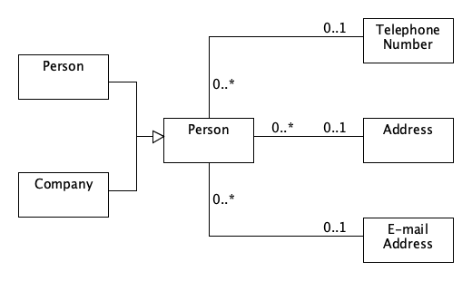
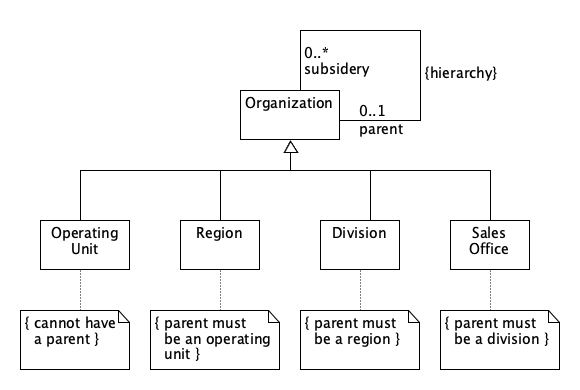
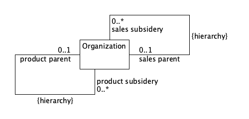

[[English]](chapter02_accountability.md)  [中文]
# 第2章 责任 Accountability

 
 

## 2.1 参与方 Party

* **问题**: 人和组织有类似的职责。.  
* **解决方案**: 创建一个参与方类型，作为人和组织的超类型。  

 
 

  
图 2.1 初步的通讯录模型  
*这个模型反映了人和组织的共性。*  

 
 

  
图 2.2  使用参与方对图 2.1进行泛化   
*在使用人和组织的许多场合，都应使用参与方模式。*  

 
## 2.2 组织层级 Organization Hierarchies

* **问题**: 表示一个分层的组织结构。  
* **解决方案**: 在组织上创建一个递归的关联关系。  

 
 

  
图 2.3  用显式的层次表示组织结构  
*这种结构既不灵活也难以重用。*  

 
 

  
图 2.4  具有层级关系的组织超类型  
*层级关系的灵活性非常大，因此必须为子类型添加规则，以约束级别间的关系。*  

 
 

  
图 2.5  两个组织层级  
*组织的子类型没有画出来。如果有很多套组织层级，这种结构很快就会失控。*  

